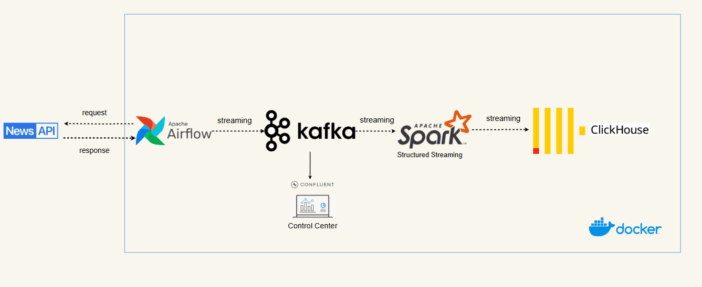
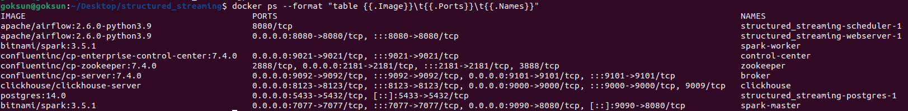
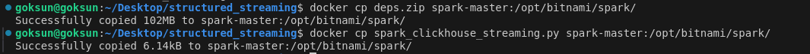
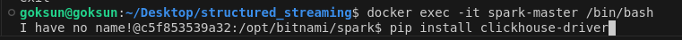
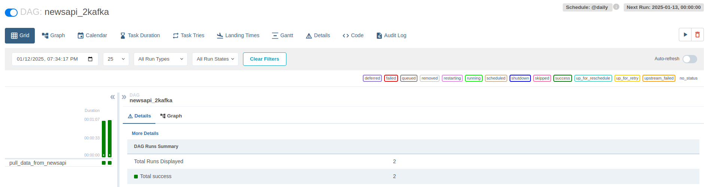
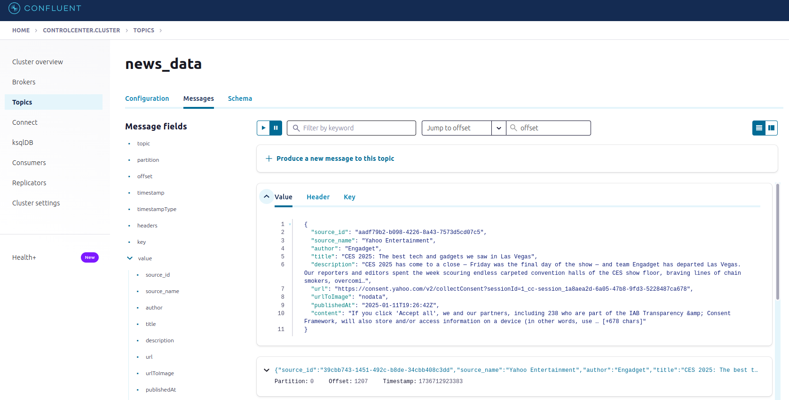
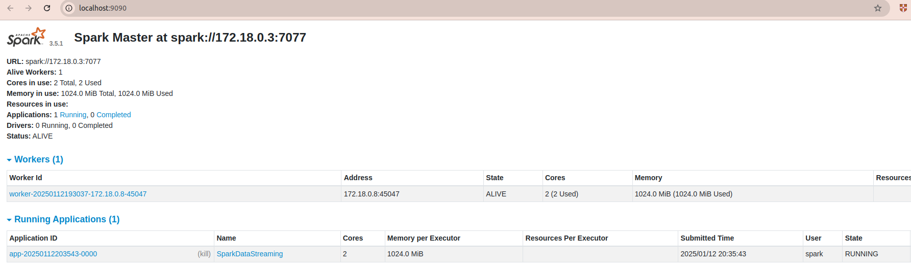
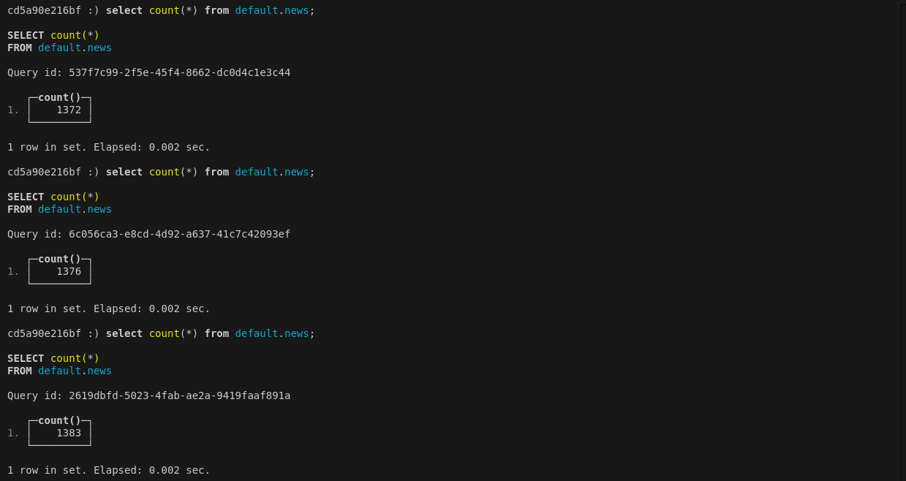

# Realtime Data Streaming | End-to-End Data Engineering Project


This repository demonstrates a data engineering pipeline using Spark Structured Streaming. It retrieves news from an API, sends the data to Kafka topics via Airflow, and processes it with Spark Structured Streaming before storing it in ClickHouse. 

The project aims to establish a real-time data analysis system for capturing and processing news data efficiently by leveraging advanced technologies and a robust data pipeline

<p align="center">
  
</p>

## Components:

**Data Source:** Uses the [newsapi.org](https://newsapi.org/) API for generating news data. \
**Apache Airflow:** Orchestrates the pipeline and schedules data ingestion. \
**Apache Kafka & Zookeeper:** Stream data from PostgreSQL to Spark. \
**Apache Spark:** Processes data in real time. \
**ClickHouse:** Stores the processed data. \
**Scripts:**

**newsapi_2kafka.py:** Airflow DAG script that pushes API data to Kafka. \
**spark_clickhouse_streaming.py:** Consumes and processes data from Kafka using Spark Structured Streaming. 

## Getting Started

1- Clone the repository:

```
git clone https://github.com/muhammetbektas/spark_clickhouse_streaming.git
```

2- Navigate to the project directory

```
cd spark_clickhouse_streaming
```

3- Set Up a Virtual Environment in Python

```
pip3 install virtualenv
python3 -m venv myvenv
source venv/bin/activate
```

4- Install the needed packages and libraries:

```
pip3 install -r ./requirements.txt
```

5- Build docker (install docker previously):

```
docker compose up -d
```

Check containers in terminal:

<p align="center">
  
</p>


6- Copy the deps.zip (dependencies zipped under (myenv/lib/python3.11/site-packages)) and spark_clickhouse_streaming.py files into spark-master container:

```
$ docker cp deps.zip spark-master:/opt/bitnami/spark/
```
```
$ docker cp spark_clickhouse_streaming.py spark-master:/opt/bitnami/spark/
```
<p align="left">
  
</p>

7- Install `clickhouse-driver` separately for spark-master and worker like following

<p align="left">
  
</p>


8- Access to Airflow UI to monitor streaming process: `localhost:8080` with account: `admin`, password: `admin`

<p align="center">
  
</p>

9- Access to `control center UI` monitor Topic health, Procuder and consumer performance, Offset, Cluster health: `localhost:9021`

<p align="center">
  
</p>

10- In a new terminal run the docker exec command to run spark job to read the streaming from kafka topic:

```
$ docker exec -it spark-master spark-submit --master spark://spark-master:7077 --packages com.clickhouse.spark:clickhouse-spark-runtime-3.5_2.12:0.8.1,com.clickhouse:clickhouse-client:0.7.2,com.clickhouse:clickhouse-http-client:0.7.2,org.apache.httpcomponents.client5:httpclient5:5.4.1,org.apache.spark:spark-sql-kafka-0-10_2.12:3.5.1,com.clickhouse:clickhouse-jdbc:0.7.1 --py-files /opt/bitnami/spark/deps.zip  /opt/bitnami/spark/spark_clickhouse_streaming.py
```

<p align="center">
  
</p>

11- ClickHouse provides a native command-line client: `clickhouse-client`. Run following command to connect clickhouse cli.
```
$ docker exec -it clickhouse clickhouse-client
```
and run count query several times to approve data is being inserted while running `newsapi_2kafka` dag task

<p align="center">
  
</p>


<b>That's all for my project, thanks for reading.
My linkedin: [muhammet-bektas](https://www.linkedin.com/in/muhammet-bektas-17b888110) </b>
